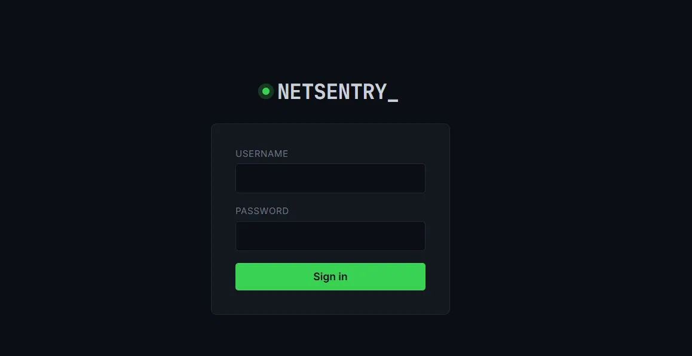
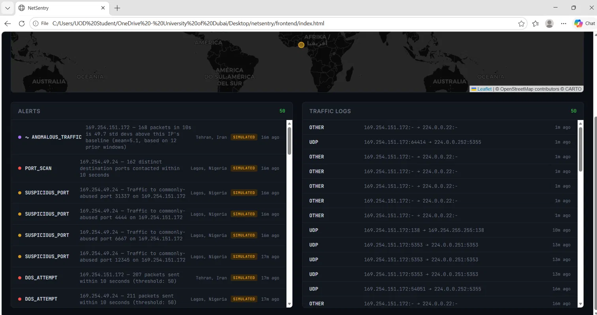
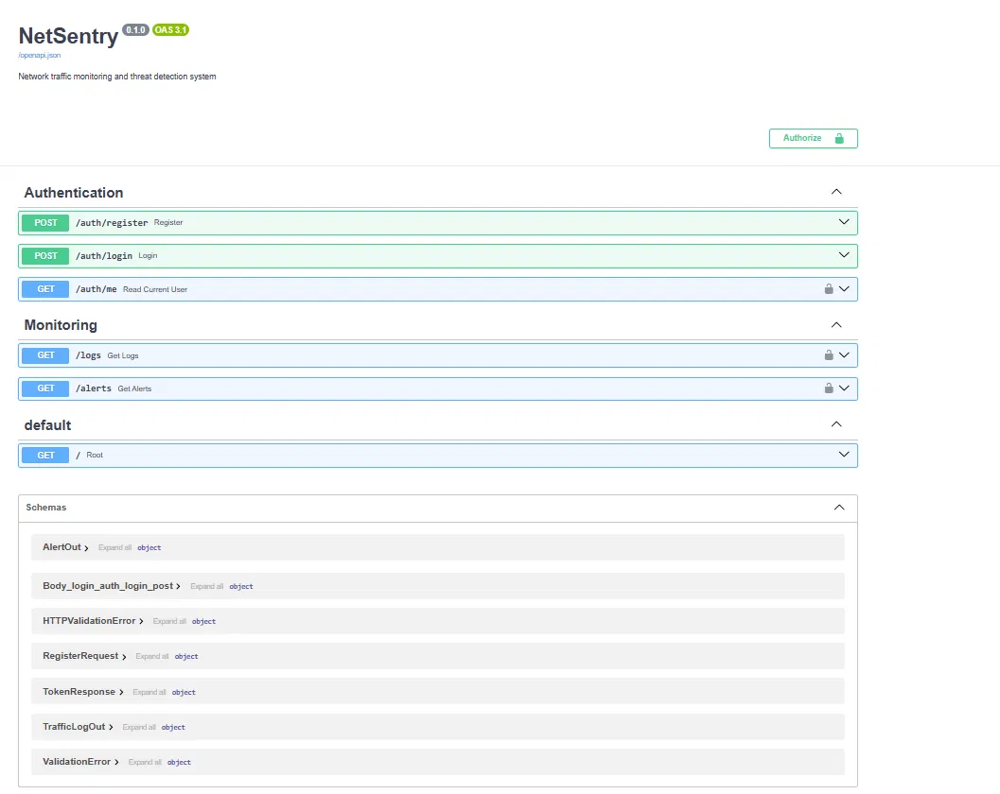

# NetSentry

NetSentry is a compact SIEM (Security Information and Event Management) capstone
project built using FastAPI, SQLAlchemy and Scapy. It captures live traffic,
runs rule-based and statistical detection, and displays encrypted alerts on a
dark-themed dashboard with an attacker map.

## Features

- JWT auth + RBAC with `admin` / `analyst` / `viewer` roles
- Live packet capture via Scapy for real-time analysis
- Rule-based detection: PORT_SCAN, DOS_ATTEMPT, SUSPICIOUS_PORT
- AES-encrypted alert data at rest
- GeoIP enrichment using MaxMind GeoLite2 with a clearly-labeled simulated
  fallback for private/non-routable test IPs
- Statistical anomaly detection using Welford's online algorithm with
  baseline-poisoning avoidance
- Dark-themed live dashboard with a Leaflet.js attacker map

## Screenshots

**Login screen**


**Dashboard — live alerts, traffic logs, and attacker map**


**API documentation (Swagger/OpenAPI)**


## Tech stack

- Python
- FastAPI
- SQLAlchemy (SQLite)
- Scapy
- JWT (python-jose)
- AES / Fernet-style encryption for sensitive fields
- MaxMind GeoLite2 (GeoLite2-City.mmdb)
- Leaflet.js (frontend attacker map)

## Architecture overview

Pipeline overview:

`capture.py` -> `detection.py` -> encrypted alerts DB -> `monitoring.py` API (RBAC)
-> frontend dashboard

- `capture.py` captures packets and writes traffic logs
- `detection.py` runs rule-based checks and the statistical anomaly detector,
  writing encrypted alerts to the database
- `monitoring.py` (API) exposes alerts and logs with RBAC enforcement
- Frontend queries the API to display alerts and a Leaflet attacker map

## Setup

1. Clone the repository:

```bash
git clone <your-repo-url>
cd netsentry
```

2. Create and activate a virtual environment

Windows (PowerShell):

```powershell
python -m venv venv
.\venv\Scripts\Activate.ps1
```

macOS / Linux:

```bash
python3 -m venv venv
source venv/bin/activate
```

3. Install dependencies:

```bash
pip install -r requirements.txt
```

4. Download the MaxMind GeoLite2-City database (not included due to license):

https://www.maxmind.com/en/geolite2/signup

Place `GeoLite2-City.mmdb` in the project root.

5. Create a `.env` file in the project root with your JWT secret:

```
SECRET_KEY=<your-generated-secret>
```

6. **Creating a user account**

Before logging into the dashboard, register at least one user via the API. With the server running, either:
- Use the Swagger UI at http://127.0.0.1:8000/docs -> POST /auth/register, or
- curl:
  ```bash
  curl -X POST http://127.0.0.1:8000/auth/register \
    -H "Content-Type: application/json" \
    -d '{"username": "admin1", "password": "yourpassword", "role": "admin"}'
  ```

(adjust the exact field names/roles to match RegisterRequest in the actual API schema)

7. Run the components (recommended order for local testing):

```bash
uvicorn main:app --reload
# in another terminal
python capture.py --iface "Ethernet 4"
# in another terminal
python detection.py
```

Note: `capture.py` requires the `--iface` flag to specify the network interface to sniff on. Interface names vary by machine and OS; on Windows you can find interface names via `ipconfig`, or use Scapy's interface listing if unsure.

The dashboard is available at the address shown by `uvicorn` (default: http://127.0.0.1:8000).

## Known limitations

- Threshold-based rules are simplistic and may require tuning for production.
- No ML model is included; anomaly detection is statistical only.
- Designed for single-host/local testing — not production scale.
- Simulated GeoIP fallback is used for non-routable test IPs and is clearly labeled.
- No alert lifecycle, correlation, or incident management features yet.
- CORS is permissive for local development; tighten before public deployment.

## Lessons learned / Challenges

- Naive vs timezone-aware `datetime` handling caused silent zero-row queries until
  timestamps were standardized to UTC.
- Python's per-process hash randomization can affect deterministic demo behavior;
  take care when ordering is important for reproducible demos.
- Baseline-poisoning in streaming anomaly detectors is real — avoid folding
  attack windows into a normal baseline.

---

## Ethical use

This project is for educational purposes. Only run packet capture and the included
detection engine on networks and systems you own or have explicit permission to
monitor.
## Research: Comparative IDS Evaluation

Alongside the NetSentry application, this repo includes a comparative research study evaluating rule-based detection (NetSentry's own logic) against machine learning approaches on the CICIDS2017 dataset.

- **`research/`** — data preprocessing, CNN and Random Forest training, evaluation scripts, and NetSentry baseline comparison, plus feature-importance and generalization analysis (DoS-trained models tested on port-scan traffic).
- **`paper/`** — IEEE conference paper draft (LaTeX source + compiled PDF) reporting the full comparison: detection accuracy, evasion resistance, and model tradeoffs.

Key finding so far: NetSentry's flow-level DoS rule achieves 0% recall against CICIDS2017 traffic (attacks arrive as many parallel low-rate connections, never crossing the per-source packet threshold), while its port-based rule for known malicious ports remains highly precise. CNN and Random Forest classifiers trained on DoS traffic show strong in-distribution performance but fail to generalize to unseen attack types (e.g. port scans) without retraining.

See `paper/evasion_resistance_ids_comparison.pdf` for full methodology and results.
